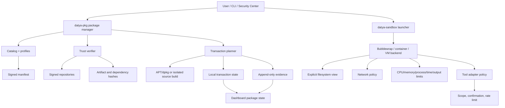

# Datya Linux High-Security Sandbox and Modular Package Manager

## Vision

Datya Linux will provide a large, modular security-tool ecosystem without turning the operating system into a locked cage. The base system remains user-owned and customizable. The sandbox protects untrusted tools, risky experiments and external-facing workflows; it does not secretly prevent a user from administering their own machine.

The design has two explicit modes:

| Mode | Meaning |
|---|---|
| **Power User** | Normal Linux control. No added sandbox is silently applied. Commands, packages, services and policies remain user-controlled. |
| **Sandboxed Workbench** | Bubblewrap/container/VM isolation, resource limits, explicit filesystem view, controlled network namespace and local evidence. |

A sandbox is a defense-in-depth boundary, not a claim of perfect anonymity or absolute malware prevention. High-risk tooling should be run in a disposable VM when kernel, device or host compromise is in scope.

## System architecture



## Package manager components

The first reference implementation is Python for inspectability and rapid tests. Its stable interfaces are designed so that the resolver and transaction state can later move into Rust without changing the user-facing command model.

| Component | Responsibility |
|---|---|
| `datya-pkg` client | CLI parsing, human/JSON output and confirmation workflow |
| Catalog resolver | Search tools, categories, profiles and lifecycle state |
| Manifest verifier | Schema, source URL, architecture, checksum and provenance checks |
| Trust store | Repository keys, trust duration, key rotation and offline roots |
| Transaction planner | Dependency graph, services, scripts, files, disk space and rollback preview |
| Transaction executor | Explicitly confirmed APT/dpkg/source-build operation |
| State database | Installed versions, files, profile membership and transaction snapshots |
| Safety auditor | Maintainer scripts, privilege, setuid/device access, network behavior and risk labels |
| Removal engine | Shared-dependency check, config classification, purge preview and rollback |
| Catalog adapter registry | Connects installed capabilities to Security Workbench policies |

## Package lifecycle

```text
catalogued → metadata-verified → packaged → installed → tested → profile-available → enabled-by-user → updated/removed
```

A package being installed never means that it is automatically running. A profile being enabled never starts a scan or executes a background command. Capability execution always requires a separate user action.

## Trust and malware defense

No package manager can prove that an upstream package contains no malicious logic. Datya therefore uses layered defenses and communicates their limits:

1. Signed repository metadata verifies the repository’s claimed origin.
2. Exact architecture artifact SHA-256 verifies that the downloaded artifact matches the reviewed metadata.
3. Dependency resolution exposes every package that will be added or removed.
4. Maintainer scripts, services, capabilities, setuid/setgid bits and device access are surfaced before confirmation.
5. Curated packages carry source, license, version, tests and review status.
6. Community packages are visibly separated from the trusted baseline.
7. Static package inspection, known-vulnerability checks and optional malware scanning run before install where available.
8. Untrusted source builds run in a disposable build environment and do not silently enter the base profile.
9. Installation is transactional where the backend permits it, with state snapshots and recovery instructions.
10. Security Center records provenance, verification status and all package transactions locally.

A checksum mismatch, unsigned repository, expired trust key or missing artifact metadata stops the default transaction. Advanced users may choose a clearly labeled override, but the warning must state exactly which verification failed and the override is recorded in the local audit log.

## Sandbox profiles

| Profile | Filesystem | Network | Resource policy | Recommended use |
|---|---|---|---|---|
| `safe` | Read-only system, writable temporary workspace | Disabled | Strict CPU, memory, process, output and timeout limits | Unknown scripts and local analysis |
| `project` | Project directory plus read-only runtime | Disabled by default | Strict limits | Development and testing |
| `lab` | Disposable workspace | Explicit lab network only | Limits required; VM preferred | Authorized security exercises |
| `power-user` | Normal user filesystem | User-controlled | No added isolation | Experienced administrator control |

The first launcher uses Bubblewrap when available and **fails closed** for sandboxed profiles when it is not installed. It never falls back silently to host execution. `power-user` is the explicit escape hatch for user freedom, and the launcher prints an audit warning that no added isolation is active.

## Resource and capability controls

Sandboxed execution can apply CPU time, address-space, process count, file-descriptor, output-size, wall-clock timeout and process-group limits. The filesystem view should expose only the required project and runtime paths. Network-disabled profiles use a network namespace; lab networking requires explicit target scope and preferably a disposable VM or container.

Device access, raw sockets, kernel modules, host mounts, credential stores, unrestricted network, and privileged containers are high-risk capabilities. They are not silently granted by installing a package. The user must see the requested capability, reason, affected boundary and recovery plan.

## Double confirmation for destructive operations

Remove, purge, recursive dependency cleanup, key deletion, configuration reset, service disablement and filesystem cleanup use two distinct prompts. The second prompt requires typing an exact package or target name. A repeated Enter key is never sufficient.

The impact preview includes direct packages, shared dependencies, files, services, keys, profiles, configuration, disk space, reversibility and rollback availability. The final prompt repeats the irreversible consequence in plain language. Plans can be exported before execution, and the transaction ID is written to the local audit record.

This protects users from commands suggested by live-stream viewers, copied chat messages or social engineering while keeping user control intact. The manager does not treat text copied from a browser or chat as trusted authorization.

## CLI surface

```text
datya-pkg search reverse
datya-pkg info nmap
datya-pkg verify nmap
datya-pkg plan-install nmap
datya-pkg plan-remove nmap --purge
datya-pkg profile show security-lab
datya-pkg install nmap --confirm
datya-pkg remove nmap --confirm --type nmap

datya-sandbox --profile safe -- python3 analysis.py
datya-sandbox --profile project -- make test
datya-sandbox --profile lab -- ./authorized-lab-tool 10.10.0.10
datya-sandbox --profile power-user -- systemctl status datya-guardian
```

The current reference CLI intentionally implements read-only discovery, verification and transaction planning first. Direct install/remove execution is the next transaction-engine milestone; this prevents a prototype from pretending to provide complete rollback before the state database and backend integration exist.

## Test and release gates

A package or sandbox feature is complete only after schema tests, checksum mismatch tests, wrong-architecture tests, dependency graph tests, maintainer-script review tests, install/remove dry-runs, double-confirmation tests, interrupted-transaction tests, no-secret-in-logs tests, sandbox fail-closed tests, resource-limit tests and local-only network tests pass.

Release artifacts require reproducible builds, signed metadata, SBOM, hardware/VM test reports, known limitations, recovery instructions and a documented distinction between “verified,” “metadata-verified,” “community,” “installed,” “tested” and “enabled.”

## Implementation boundary

The system cannot guarantee that an arbitrary root user will never be able to bypass a local control. The goal is transparent, strong defense-in-depth: protect default workflows, isolate untrusted tools, make every privilege and network effect visible, preserve rollback and evidence, and never claim more security than the tests support.
